# Table Components Architecture Diagrams

## 1. Class Hierarchy

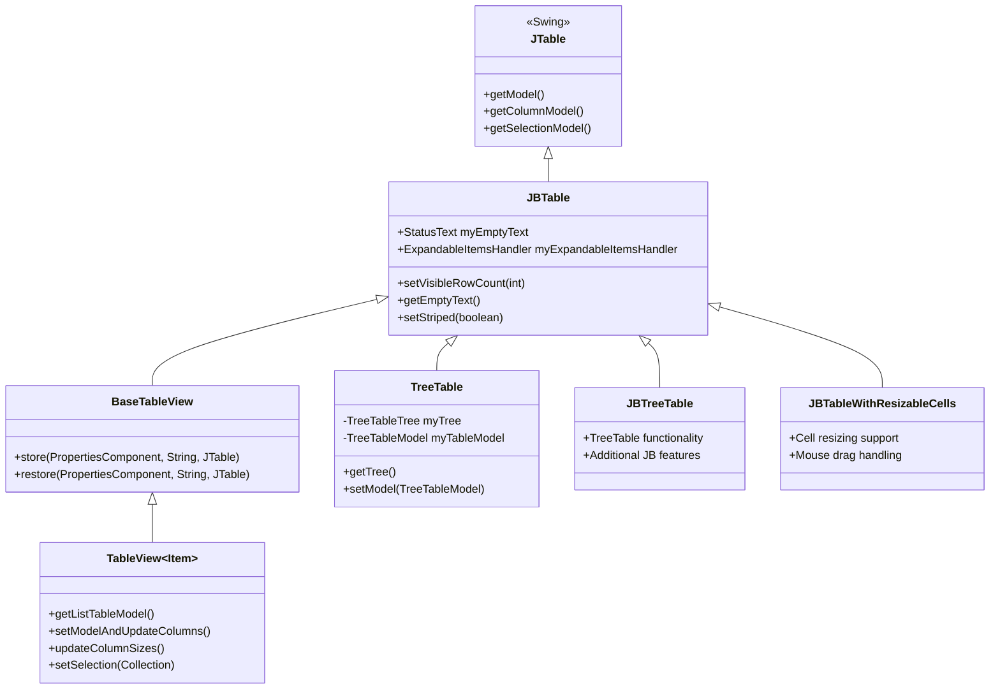

## 2. Data Model Architecture

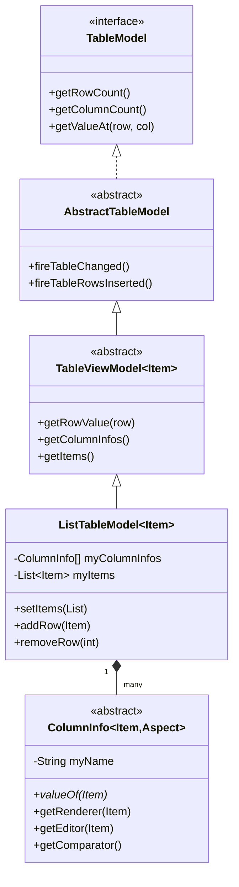

## 3. Renderer System

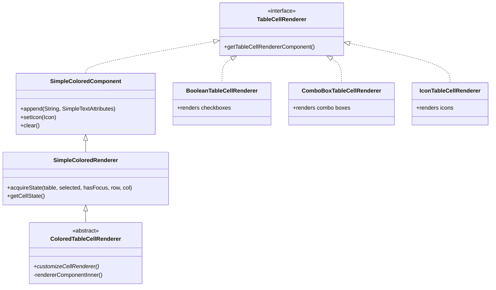

## 4. Editor System

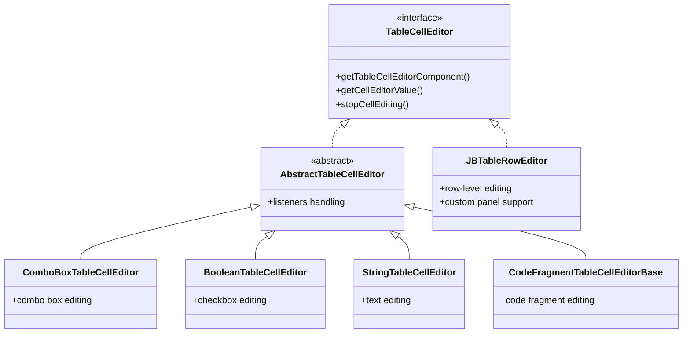

## 5. Component Interaction Flow

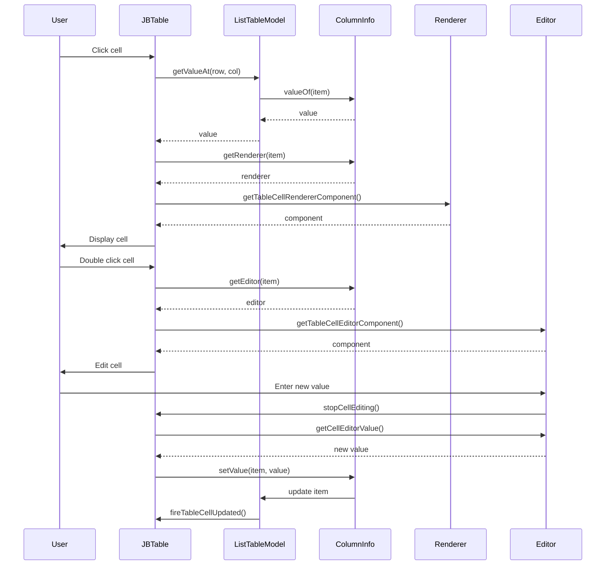

## 6. TableView with ColumnInfo Pattern

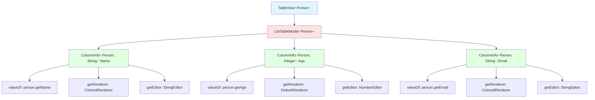

## 7. Utility and Support Components

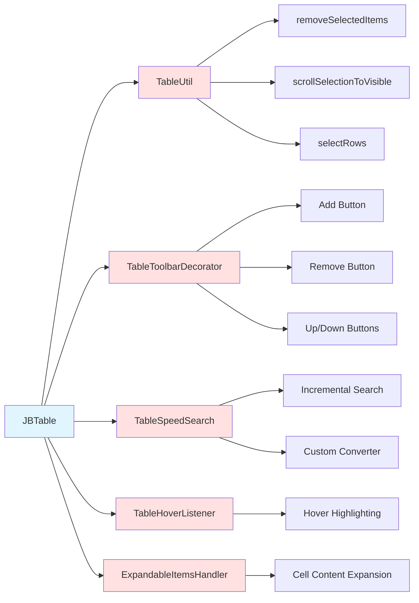

## 8. TreeTable Architecture

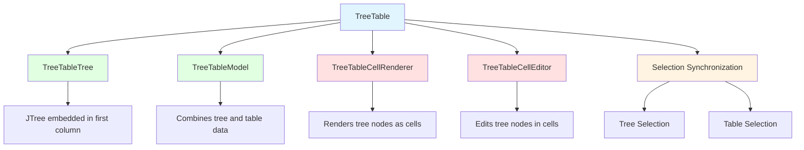

## 9. Data Flow in TableView

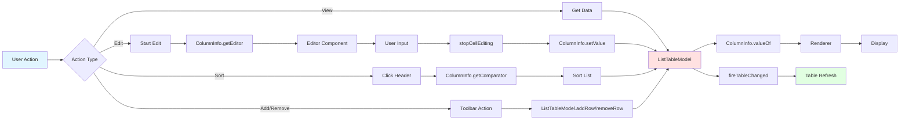

## 10. Performance Optimization Strategies

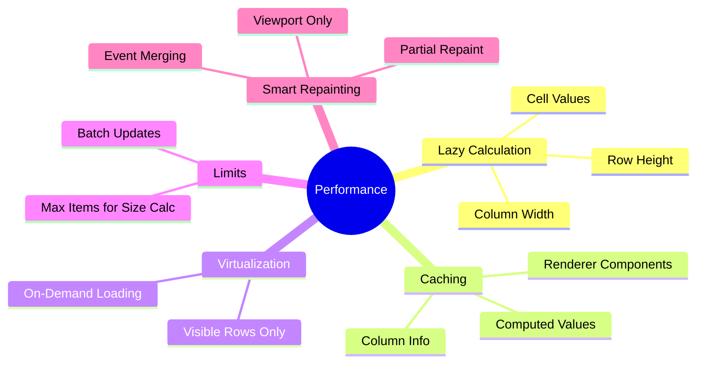

## 11. Extension Points

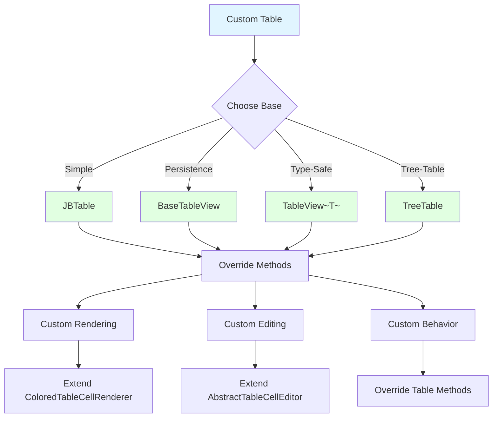

## 12. Common Usage Patterns

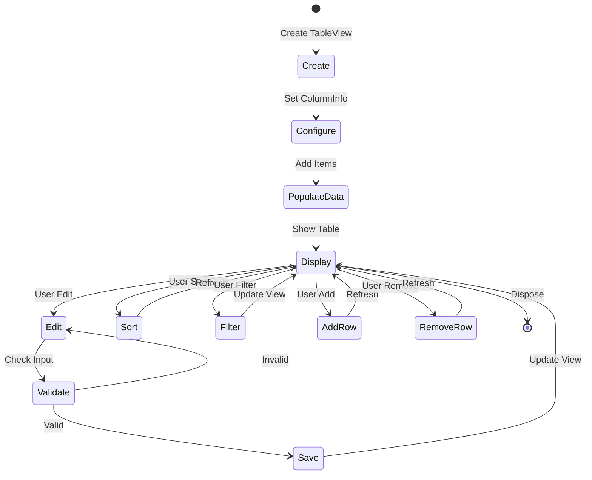

---

These diagrams provide a visual representation of the table component architecture in IntelliJ IDEA Community. They can be rendered using any Mermaid-compatible viewer or editor.
